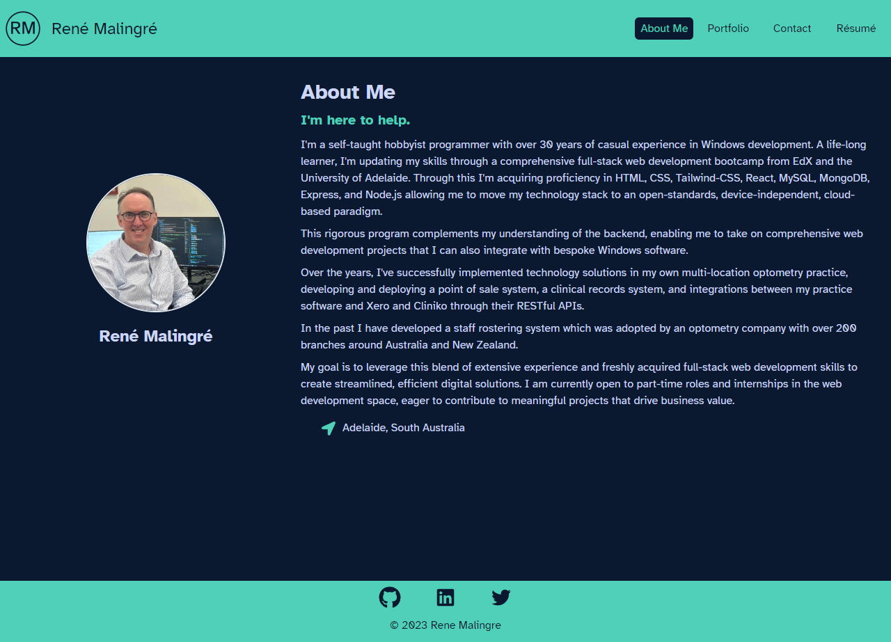

# René Malingré's Portfolio - Here to Help

 [](https://opensource.org/licenses/MIT)

This Project is a portfolio written using React.js for an aspiring full-stack web developer. It showcases the developer's recent projects in order to communicate his skills to employers and clients looking to hire. It also provides a way for them to get in touch with the developer.

## Table of Contents

- [Features](#features)
- [Installation and Usage](#installation-and-usage)
- [Technologies Used](#technologies-used)
- [Screenshots](#screenshots)
- [Live URL and Repository](#live-url-and-repository)
- [Credits](#credits)
- [Contributing](#contributing)
- [License](#license)

## Features

 The application is written using React and formatted with Chakra-ui styles and components, and a custom colour palette. It is deployed to GitHub Pages. It is a single page application, and was written with a mobile-first, responsive design.

It uses the Atkinson Hyperlegible font, which was designed to increase legibility for readers with low vision. It is free to use and can be downloaded from the [Braille Institute](https://www.brailleinstitute.org/freefont). The motivation for this choice was that the author of the portfolio is an optometrist and is passionate about accessibility.

The application has the following features:

- A navigation bar with links to the different pages of the site.
- The landing page is the 'About Me' page, which contains a short bio and a photo of the developer.
- The 'Portfolio' page contains a list of recent projects that the developer has worked on, with links to the deployed applications and the GitHub repositories.
- The 'Contact' page contains a contact form, which can be used to send a message to the developer, and it has other contact details.
- The 'Résumé' page contains the developer's résumé, and a link to a version which can be downloaded as a PDF file.
- The footer contains links to the developer's GitHub, Twitter and LinkedIn profiles.
- It is a Progressive Web Application (PWA) and it can be installed, and it has a service worker which caches the application for offline use.

## Installation and Usage

Clone the repository to your local machine. Open the terminal in the root directory of the application.

Run the following terminal commands to install the dependencies and start the application:

```bash
run npm install && npm start
```

The application will open in your default browser at the following URL: [http://localhost:3000](http://localhost:3000)

## Technologies Used

- React
  - Create React App
  - React Dom
  - React Hooks
  - React icons
- Chakra-ui Components
- gh-pages
- Atkinson Hyperlegible font
- Node.js

## Screenshots

### Desktop Browser - Showing the About Me Page



### Desktop Browser - Showing the Portfolio Page


### Mobile Browser - Contact Page and Résumé Page


## Live URL and Repository

The live application can be accessed at the following URL: [Rene Malingre Portfolio](https://renemalingre.github.io/here-to-help/)

The repository can be accessed at the following URL: [Rene Malingre Portfolio GitHub repository](https://github.com/ReneMalingre/here-to-help)

## Credits

The following resources were used in the development of this application:

- [Create React App](https://create-react-app.dev/) - for bootstrapping the application
- [React](https://reactjs.org/) - a JavaScript library for building user interfaces
- [Chakra-ui](https://chakra-ui.com/) - a React component library
- [gh-pages](https://www.npmjs.com/package/gh-pages) - for deployment to GitHub Pages
- [Atkinson Hyperlegible font](https://www.brailleinstitute.org/freefont) - a font designed to increase legibility for readers with low vision
- [Node.js](https://nodejs.org/en/) - for running JavaScript outside of the browser
- [Visual Studio Code](https://code.visualstudio.com/) - the code editor used for writing the application
- [ChatGPT](https://chat.openai.com/) - for help with learning Chakra-ui components
- [Brittany Chiang](https://brittanychiang.com/) - inspired the colour palette of the application

## Contributing

Contributions to this project will not be accepted, as this project is an assessment piece for a coding course, and it must be the project author's own work. However, feel free to fork the repository and make your own changes.

## License

This project is licensed under the terms of the MIT license.

© 2023 René Malingré
